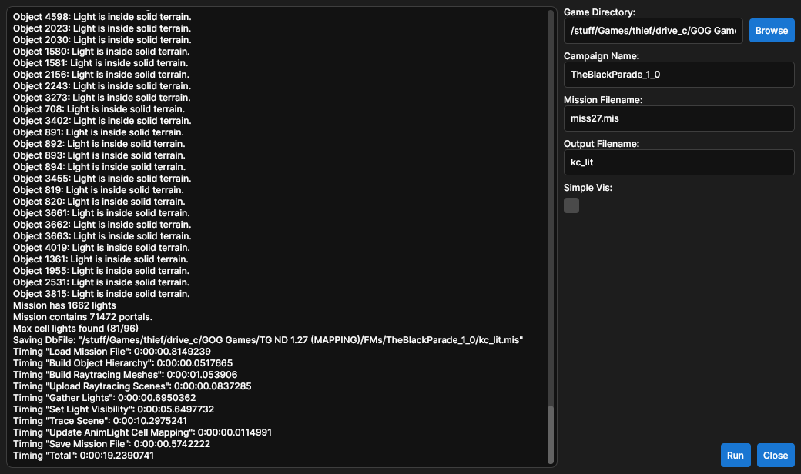
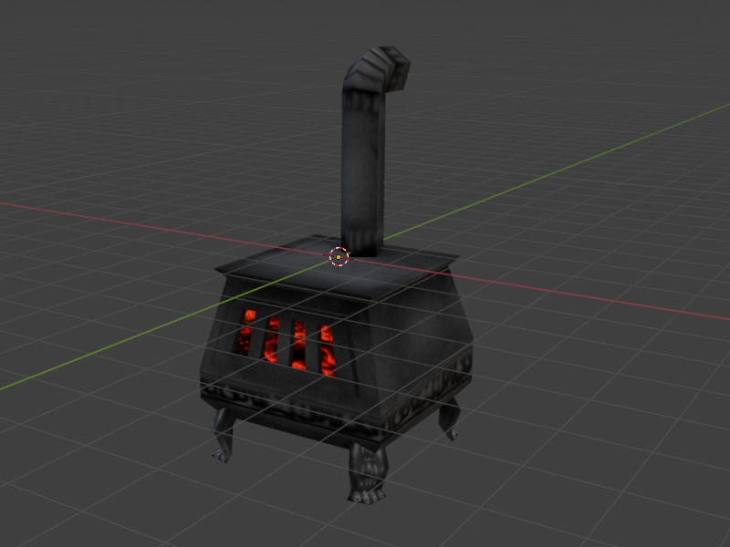

# KCTools

[](#ai-policy)
[](#license)

## Description

[TTLG Release Thread](https://www.ttlg.com/forums/showthread.php?t=152903)

KCTools is a collection of tools for working with [NewDark 1.28](https://www.ttlg.com/forums/showthread.php?t=152974) files. Currently there are two tools, a lightmapping tool, and a .BIN model export tool. The latest release can be downloaded [here](https://github.com/JarrodDoyle/KeepersCompound.Lightmapper/releases/latest).

## Light

An external lightmapping tool for [NewDark 1.28](https://www.ttlg.com/forums/showthread.php?t=152974) fan missions. DromEd's built-in lighting is single-threaded, has a number of bugs, and scales extremely poorly with lightmap scale and large open spaces. KCTools Light uses a multithreaded approach with a modern raytracing library to improve lighting times, reduce lighting artifacts, and often improves in-game performance in complex scenes.

### Features

- All DromEd lighting functionality
- Massively improved lighting times
- Better light culling, improving performance in large-scale city maps and eliminating object lighting errors
- Additional warnings to mappers for mis-configured lights
- Produces generally more accurate shadows
- Near seamless integration within DromEd thanks to a custom script module

### Benchmarks

All tests were performed on a PC with a `Ryzen 5 2600` CPU. I've used a variety of mission sizes and types to help show what sort of missions benefit most from KCLight.

| Mission                           | DromEd   | KCLight  | Speedup |
|-----------------------------------|----------|----------|---------|
| Alcazar                           | 00:00:03 | 00:00:02 | ~1.5x   |
| Cinder Notes                      | 00:05:12 | 00:00:12 | ~26x    |
| Fierce Competition                | 00:00:08 | 00:00:01 | ~8x     |
| Godbreaker M2: Impious Pilgrimage | 00:07:21 | 00:00:03 | ~147x   |
| Into the Odd                      | 00:01:41 | 00:00:05 | ~20x    |
| Malazars Tower                    | 00:00:46 | 00:00:06 | ~7.5x   |
| TBP M8: Jaws of Darkness          | 00:08:23 | 00:00:18 | ~28x    |
| The Scarlet Cascabel M2           | 00:01:30 | 00:00:02 | ~45x    |
| TPOAIR M2: Collecting it All      | 01:00:58 | 00:00:27 | ~135x   |
| Winds of Misfortune               | 00:15:23 | 00:00:05 | ~185x   |

### Usage

KCTools Light is available as a straightforward GUI (`KCLight.Gui.exe`) if you don't have much experience using a terminal:


To use the CLI, open a console in the KCTools folder and run `KCTools light --help` to see the help screen:
```
light: Compute lightmaps for a NewDark .MIS/.COW

Usage:
  KCTools light <install-path> <mission-name> [options]

Arguments:
  <install-path>  The path to the root Thief installation. [required]
  <mission-name>  Mission filename including extension. [required]

Options:
  -c, --campaign-name  Fan mission folder name. Uses OMs if not specified.
  -o, --output-name    Name of output file excluding extension. Overwrites existing mission if not specified.
  -i, --inspect        Report light configuration problems without performing any lighting. [default: False]
  -q, --quiet          Disable terminal output. [default: False]
  -a, --auto-campaign  Automatically obtain campaign name from `DromEd.log`. Overrides `--campaign-name`. [default: False]
  -?, -h, --help       Show help and usage information
```

## Model Export

Exports models as a [binary GLTF](https://en.wikipedia.org/wiki/GlTF). Sub-object and joint hierarchy is respected and textures are bundled into the exported `.glb`.



### Usage

Open a console in the KCTools folder and run `KCTools model export --help` to see the help screen:

```
export: Export models to .GLB

Usage:
  KCTools model export <install-path> [options]

Arguments:
  <install-path>  The path to the root Thief installation. [required]

Options:
  -c, --campaign-name     The folder name of a fan mission.
  -m, --model-name        The name of the model.
  -o, --output-directory  Folder to output exported models to. If not set models will be exported to a `models` directory alongside kctools.
  -q, --quiet             Disable terminal output. [default: False]
  -?, -h, --help          Show help and usage information
```

## Building

This project requires the [.NET 10.0 runtime and SDK](https://dotnet.microsoft.com/en-us/download/dotnet/10.0). Raytracing uses a forked version of [TinyEmbree](https://github.com/pgrit/TinyEmbree) with backface culling enabled, a pre-built package can be found in `LocalPackages`.

## AI Policy

This repo operates under a strict "No LLM/AI contributions" policy:

- No LLMs for issues
- No LLMs for PRs
- No LLMs for communication

Any contributor found to be in violation of this policy will have their contribution rejected and be banned from future contributions.

## License

All code within this repository is under the [MIT License](LICENSE) unless otherwise stated.